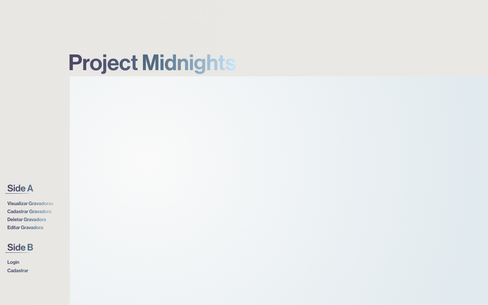

# Project Midnights

Sistema de cadastro de Gravadoras. Feito para disciplina PPWI4 (Programação para Web) na faculdade. Inspirado na capa do álbum [Midnights](https://pt.wikipedia.org/wiki/Midnights).

## Stack

- Java (SpringBoot)
- JavaScript (ReactJS)
- SQL (MySQL)

## Preview

**PROJETO EM ANDAMENTO**

